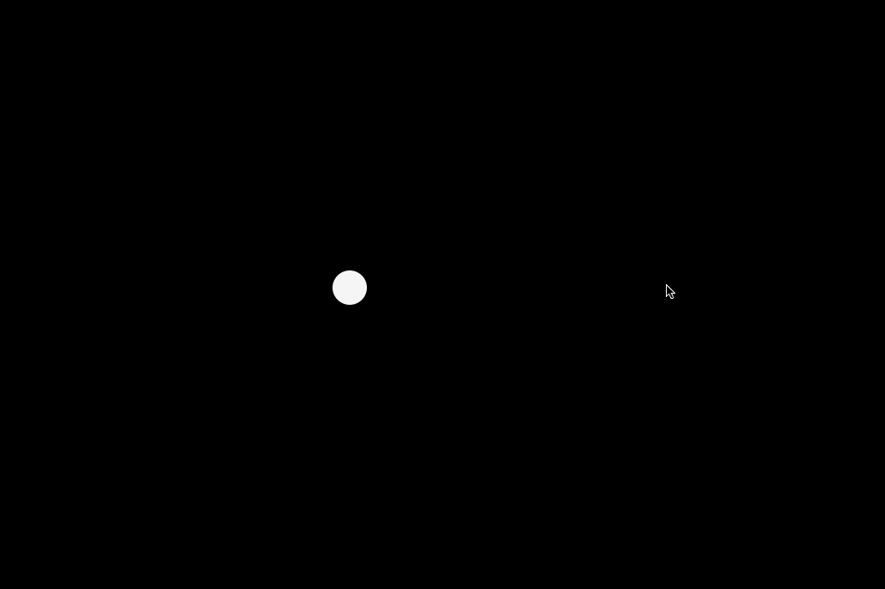

+++
date = "2015-09-19T21:39:46+09:00"
image = "movingParticle.gif"
title = "movingParticle"

+++
  
[Source Code](https://github.com/nomi1126/processing_work/tree/master/2015_07_31_moving_particle/movingParticle)
